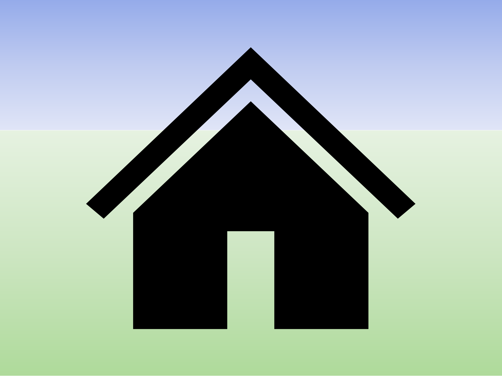

# Halle

Die lichtdurchflutete Reithalle mit den Maßen 20x40 verfügt über einen elastischen Reitboden. Unsere moderne Beregnungsanlage sorgt für staubfreies Reiten.

   
  

# Außenreitplatz

Nutzen Sie bei schönem Wetter unseren Außenreitplatz mit den Maßen 20x40. Der Platz ist mit einer sichern Holzbande umzäunt.

   
  

# Round Pen

Nutzen Sie den Round Pen nicht nur zum longieren, sondern auch für die Freiarbeit mit Ihrem Pferd.

   
  

# Einrittstelle in die Tauber

Von unserer Anlage haben sie direkten Zugang zur Tauber, wo sie mit ihrem Pferd hineinreiten und das Wasser genießen können.

   
  

# Weiden

Unsere Pferde stehen in Herdenhaltung im Sommer ganztägig auf unseren weitläufigen, gepflegten Weiden. Der alte Baumbestand sorgt für ausreichend Schatten. Täglich wird frisches Wasser auf die Weiden gebracht.

   
  

# Boxenstall

Der Stall bietet große freundliche Boxen mit Außenfenster oder mit offenem Blick auf die Stallgasse. Der Boxenstall hat einen direkten Zugang zur Reithalle. Die Boxen sind mit Späne eingestreut, sodass diese auch für Allergiker gut geeignet sind.

Alle unsere Pferde stehen ganztägig in Gruppenhaltung auf den Paddocks/Weiden. Ihr Pferd kann wahlweise nachts in der Box oder 24 Stunden, 7 Tage die Woche im Offenstall stehen.

   
  

# Offenstall

Unsere Offenställe mit beheizter Selbsttränke und großzügigen Unterstehmöglichkeiten bieten reichlich Auslauf. Die Paddocks sind alle mit Bodenplatten belegt, sodass keine Matschkoppeln entstehen können. Alle unsere Pferde stehen ganztägig in Gruppenhaltung im Offenstall oder auf den Weiden. Ihr Pferd kann wahlweise 24/7 im Offenstall oder nachts in einer Box in stehen.

   
  

# Ausreitgelände

Ein wunderschönes Außreitgelände schließt sich direkt an unseren Stall an. Erkunden Sie die Umgebung auf eigene Faust oder nehmen Sie an geführten Ausritten teil.
